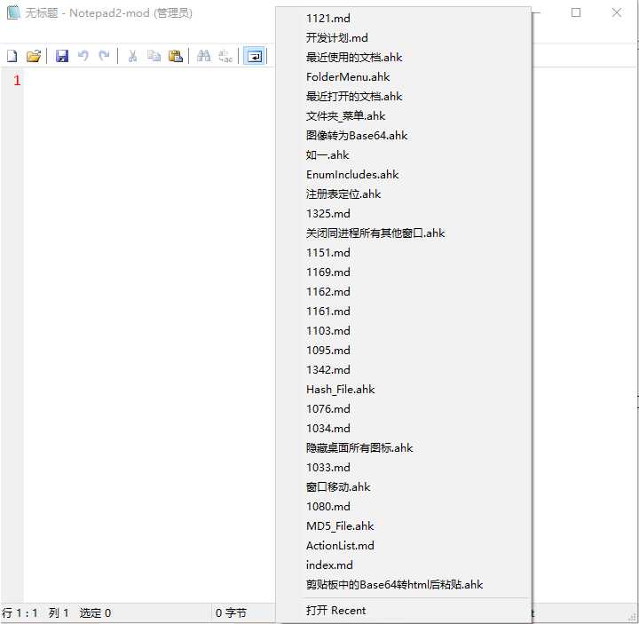

<link rel="stylesheet" href="../actions/css/atom-one-light.min.css">
<script src="../actions/js/highlight.min.js"></script>
<script>hljs.highlightAll();</script>

[返回主页](../index.md)

# [](#header-2) 最近打开

**动作编号**: 1121  
**动作名称**: 最近打开  
**动作作用的对象**: 特定窗口  
**动作热键**: 无  
**动作鼠标手势**: 无  
**动作说明**: 显示系统最近打开的文档的菜单  
**动作截图**:  
    
**动作内容**: run|"%B_Autohotkey%" "%A_ScriptDir%\外部脚本\窗口处理\最近使用的文档.ahk"  
执行外部脚本文件 "最近使用的文档.ahk", ATA 内置动作  

**代码或详细解释**:  
执行动作, 在特定的窗口显示一个最近打开文件的菜单.  
点击菜单项目, 则使用当前窗口的进程打开相应的文件. 按住 Shift 点击菜单, 则直接运行相应项目.  

```AutoHotkey
RecentFolderPath := upDir(A_StartMenu) "\Recent"
DetectHiddenWindows, On
WinGetTitle, h_hwnd, 获取当前窗口信息 ;ahk_class AutoHotkeyGUI
Windy_CurWin_id := StrReplace(h_hwnd, "获取当前窗口信息_")
if Windy_CurWin_id
{
	WinGetClass, Windy_CurWin_Class, ahk_id %Windy_CurWin_id%
	WinGet, Windy_CurWin_Fullpath, ProcessPath, Ahk_ID %Windy_CurWin_id% 
}
else
{
	WinGetClass, Windy_CurWin_Class, A
	WinGet, Windy_CurWin_Fullpath, ProcessPath, A
}

if instr(Windy_CurWin_Class, "Notepad") or (Windy_CurWin_Class = "SciTEWindow")
	menu, % LnkFolderMenu(RecentFolderPath, "txt,ahk,htm,md,ini","收藏夹",0,2), show
else if (Windy_CurWin_Class = "CabinetWClass") or (Windy_CurWin_Class = "Progman")
	menu, % LnkFolderMenu(RecentFolderPath, "","收藏夹",0,2), show
else if (Windy_CurWin_Class = "WinRarWindow")
	menu, % LnkFolderMenu(RecentFolderPath, "rar,zip,7z","收藏夹",0,2), show
return
```