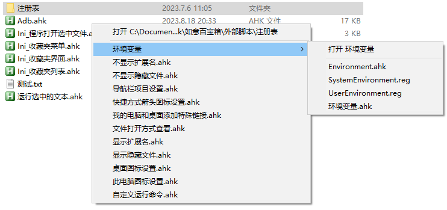

<link rel="stylesheet" href="../actions/css/atom-one-light.min.css">
<script src="../actions/js/highlight.min.js"></script>
<script>hljs.highlightAll();</script>

[返回主页](../index.md)

# [](#header-2) FolderMenu

**动作编号**: 1177  
**动作名称**: FolderMenu  
**动作作用的对象**: 选中文件夹  
**动作热键**: 无  
**动作鼠标手势**: 无  
**动作说明**: 将选中文件夹以菜单形式显示(以文件夹中的文件创建一个右键菜单)  
**动作截图**:  
    
**动作内容**: run|"%B_Autohotkey%" "%A_ScriptDir%\外部脚本\文件处理\文件夹处理\FolderMenu.ahk" "%CandySel%"  
以选中文件夹路径作为参数, 执行外部脚本文件 "FolderMenu.ahk", ATA 内置动作  

**代码或详细解释**:  
选中文件夹后, 执行动作, 显示一个文件夹中所有文件的菜单.  
点击菜单项目, 则打开相应的文件. 按住 Shift 点击菜单, 则使用 notepad2 编辑相应项目.  

```Autohotkey
CandySel :=  A_Args[1]
CandySel2 :=  A_Args[2]
if !CandySel2
	CandySel2 := "*"
menu, % FolderMenu(CandySel, CandySel2, "收藏夹", 0, 1, 0, 1), show
return
```